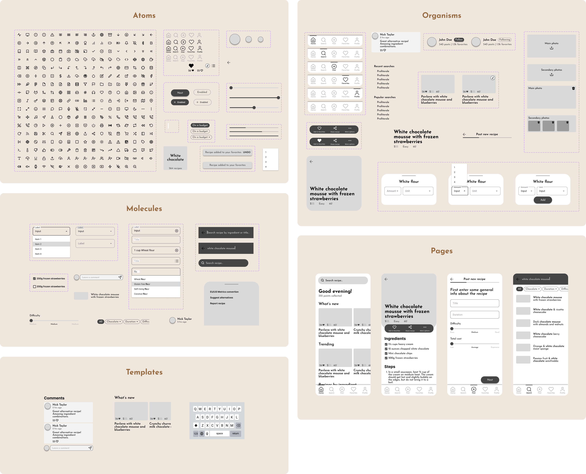

<h2>Mobile high fidelity wireframes</h2>

<h2>Tablet high fidelity wireframes</h2>

  

    <h2>Interactive mid fidelity wireframes</h2>
    <a href="#" target="_blank">
    
      

        
        <h3>Try it yourself on Figma</h3>
      

    </a>
  

  

    <h2>Interactive high fidelity prototypes</h2>
    <a href="#" target="_blank">
    
      

        
        <h3>View them on Figma</h3>
      

    </a>
  

<h2>Design system</h2>

<h2>Style guide (short)</h2>

